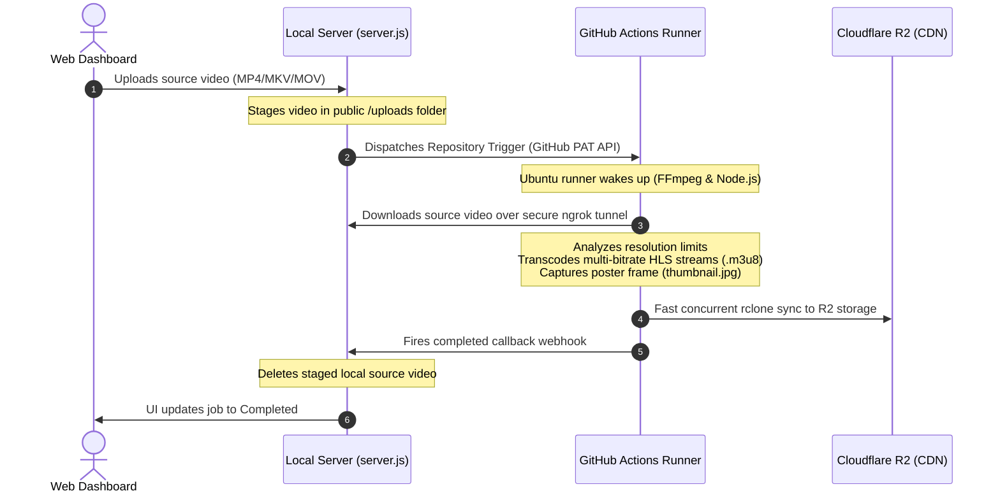

# ⚡ HLS Cloud Encoder: Distributed Cloud-Scale Transcoding

A hybrid, high-efficiency video transcoding and hosting pipeline. By offloading resource-intensive transcoding tasks to **GitHub Actions** and distributing streams via **Cloudflare R2**, this system achieves **near-zero operational costs** for processing and globally delivering HLS multi-bitrate video streams.

---

## 📐 Hybrid Architecture & Workflow

This system divides work into three distinct tiers:



### The Three Tiers
1. **The Web Dashboard & Management Tier (Local / Self-hosted Express server)**:
   Accepts chunked video uploads from the client dashboard, exposes the file temporarily via a secure public link, triggers the remote runner, and cleans up the heavy source file upon completion callback.
2. **The Heavy Compute Transcoding Tier (GitHub Actions)**:
   A fresh Ubuntu container handles the CPU-heavy workload. It evaluates the vertical native resolution (preventing wasteful upscaling), transcodes HLS streams in parallel streams (`libx264`/`aac`), generates a master playlist, and captures a matching `thumbnail.jpg` frame.
3. **The Global Storage & Delivery Tier (Cloudflare R2)**:
   Saves generated assets directly to Cloudflare R2 storage using optimized parallel synchronization pipelines (`rclone`).

---

## 💸 Why Cloudflare R2 + GitHub Actions? (Cost Comparison)

Traditional video processing and streaming setups incur severe hosting and egress transfer fees. Below is a cost model comparison for hosting **1 TB of video content** and delivering **5 TB of monthly stream egress**:

| Platform | Storage Cost (1 TB) | Egress Bandwidth Cost (5 TB) | CPU Transcoding Cost (Per Hour) | Estimated Monthly Total |
| :--- | :--- | :--- | :--- | :--- |
| **AWS (S3 + CloudFront)** | \$23.00 / mo | \$450.00 / mo (\$0.09 / GB) | \$0.15 - \$0.40 (AWS Elastic Transcoder) | **\$473.00+** |
| **Bunny CDN (Stream & Storage)** | \$10.00 / mo | \$25.00 / mo (\$0.005 / GB) | Included in Stream processing | **\$35.00** |
| **HLS Cloud Encoder (R2 + GH)** | **\$15.00 / mo** | **\$0.00 (Zero Egress Fees)** | **\$0.00 (Free GitHub Actions Minutes)** | **\$15.00 (Flat)** |

### Financial Advantages:
* **Unlimited Scaling (Free Egress)**: Cloudflare R2 is built on the bandwidth-alliance principle, charging exactly **\$0.00 for data transfer out**. You pay only for storage (\$0.015/GB), making your delivery budget completely predictable.
* **Completely Free Compute**: Utilizes the free GitHub Actions builder allocation (2,000 to 3,000 free runner minutes per month per account). 

---

## 🛠️ System Prerequisites

### Client-Side Server Requirements
* **Node.js 20+** installed locally.
* **ngrok** or a **Cloudflare Tunnel** to tunnel local files and receive webhooks.

### External Accounts & APIs
* **GitHub Personal Access Token (PAT)**: Classic token with full `repo` scopes.
* **Cloudflare Account**: With an active R2 bucket.

---

## 📂 Project Structure

```
├── .github/
│   └── workflows/
│       └── encode.yml          # GitHub Actions workflow script
├── public/
│   ├── index.html              # Management Web Dashboard (Vercel style)
│   └── player.html             # Clean HLS player with manual resolution switching
├── .env.example                # Local environment secrets config template
├── .gitignore                  # Git ignore rules
├── package.json                # Project dependencies
├── server.js                   # Node.js backend controller server
├── main.md                     # System technical blueprint specifications
└── steps.md                    # Detailed step-by-step setup guides
```

---

## 🚀 Setup & Launch

Refer to [steps.md](file:///C:/Users/Spy/Desktop/cheap%20video%20encoding/steps.md) for full step-by-step instructions on pushing this repository, adding your Cloudflare secrets, setting up the environmental `.env` configurations, creating an ngrok tunnel, and deploying your public server.

### Quick Start:

1. Clone or initialize the repository.
2. Push the files to a secure private/public repository on GitHub.
3. Add your `R2_ACCESS_KEY_ID`, `R2_SECRET_ACCESS_KEY`, `R2_ENDPOINT`, and `R2_BUCKET_NAME` keys to **GitHub Action Secrets**.
4. Configure `.env` with your GitHub PAT, repository details, and tunnel URL.
5. Launch the Node instance:
   ```bash
   npm install
   npm start
   ```
6. Visit `http://localhost:3000` to upload a video, start transcoding, and preview the output live in your sleek HLS Player!

---

## 📜 License
Licensed under the [MIT License](LICENSE). Free for both personal and enterprise use.
